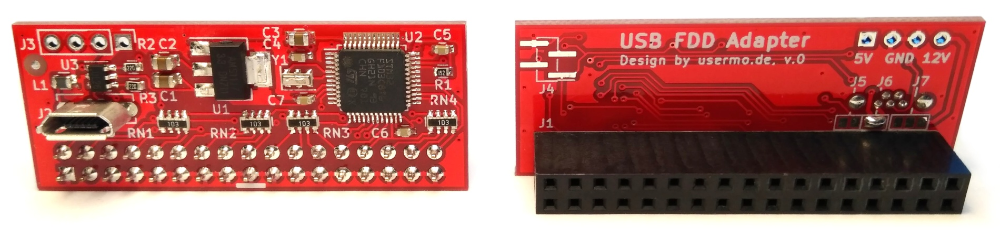

# USB to Floppy-Disk Drive Adapter

This project provides the CAD files for an STM32-based floppy-disk controller that can be attached to the back of an ordinary 3.5 inch floppy-disk drive and connected to a USB host via micro USB port.

## Hardware

The core of this adapter is the popular STM32F103C8T6 microcontroller by STMicroelectronics.
Please consult the [PDF schematic](schematic.pdf) for details.

### Configuration

The adapter can be used in several different hardware configurations that can be selected via solder bridges.

The following drive types are supported:

- PC drives
- IBM PS/2 drives
- drives with shugart interface

Drives that only use the 5V line and consume less than approx. 480mA can be powered via USB, other drives have to be powered externally.

J5    | J6    | J7       | Use case
------|-------|----------|---------
▒▒░▒▒ | ▒▒░▒▒ | ▒▒░▒▒░▒▒ | PC drive, externally powered
▓▓▓▓▓ | ▒▒░▒▒ | ▒▒░▒▒░▒▒ | IBM PS/2 drive without 12V line
▒▒░▒▒ | ▓▓▓▓▓ | ▒▒░▒▒░▒▒ | PC drive, USB-powered
▒▒░▒▒ | ▒▒░▒▒ | ▓▓▓▓▓░▒▒ | pin 4 and 6 shorted, for shugart drives that do not use pin 4
▒▒░▒▒ | ▒▒░▒▒ | ▒▒░▓▓▓▓▓ | 12V on pin 4, for PS/2 drive

The power connector J3 can be used as either input or output.

Configurations other than the USB-powered PC drive (see [picture](img/pc_drive.jpg)) are untested.

## Firmware

As of August 2020, there is no working firmware for this adapter, yet.

The objective is to adapt the firmware provided by the [Greaseweazle project](https://github.com/keirf/Greaseweazle).
It does already provide support the same microcontroller, albeit for a much bulkier adapter with a different pinout.

### Programming via Serial Wire Debug Interface

The adapter provides solder pads for an SWD programming device. They are labeled J4 on the PCB.

Pin on J4 | Function
----------|---------
1 | 3.3V
2 | SWDIO
3 | SWCLK
4 | GND

## Software

Please refer to the Greaseweazle documentation for PC-side software that will be used with this adapter.

## License

The following license applies to the files in this repository:

This work is licensed under the Creative Commons Attribution-ShareAlike 4.0 International License. To view a copy of this license, visit http://creativecommons.org/licenses/by-sa/4.0/ or send a letter to Creative Commons, PO Box 1866, Mountain View, CA 94042, USA.
